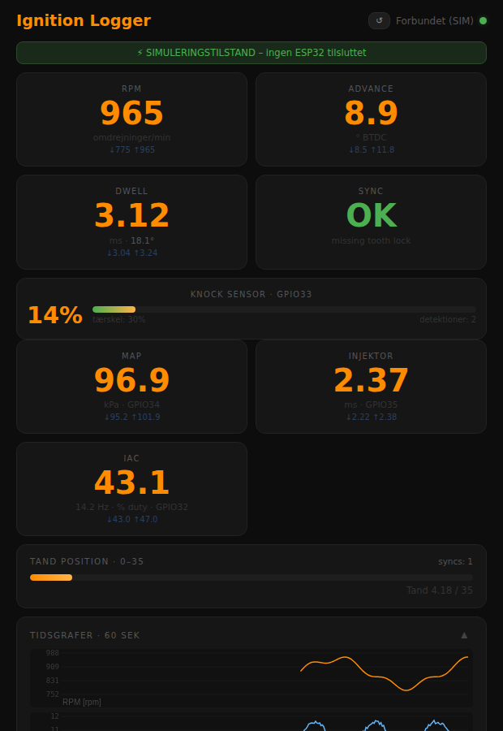
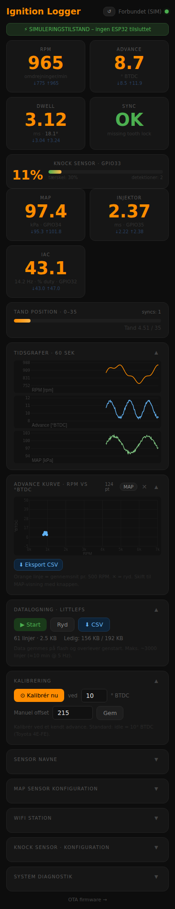
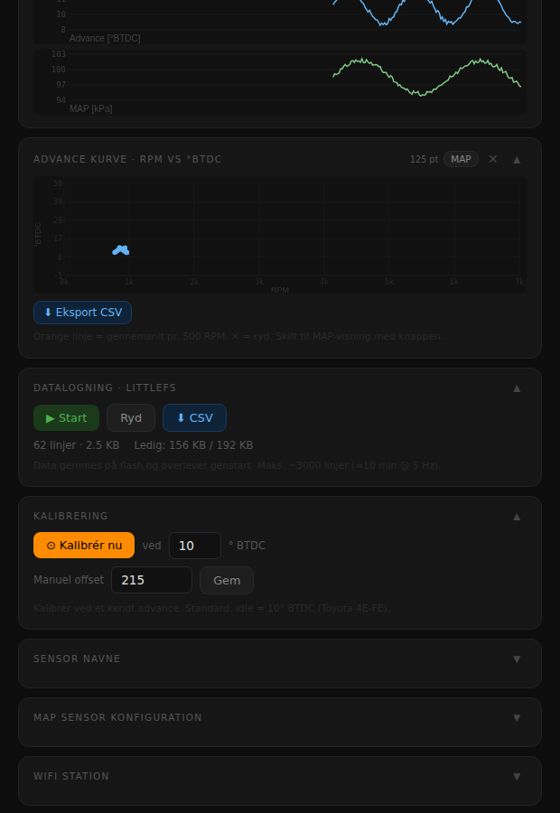

# OEM Ignition Logger

Reverse engineer Toyota 4E-FE OEM ECU via ESP32.
Måler advance (°BTDC), dwell, RPM, MAP-tryk og injektor-pulsbredde ud fra NE og IGT signaler.

## Web Flash

**[⚡ Flash ESP32 her](https://joachimth.github.io/esp32-ecu-reversing-for-speeduino/)**

Kræver Chrome eller Edge med Web Serial API (USB-kabel til ESP32).

## Live Dashboard

Tilslut WiFi og åbn dashboardet – vises automatisk som captive portal:

| Parameter  | Værdi |
|------------|-------|
| WiFi SSID  | `IgnLogger` |
| Password   | `ignition1` |
| Dashboard  | http://192.168.4.1 |
| OTA update | http://192.168.4.1/update |

### Funktioner
- **RPM, Advance °BTDC, Dwell ms, Sync** – altid synlige
- **MAP kPa, Injektor ms, IAC %** – vises automatisk ved tilslutning af sensorer
- **Rå datalogning** – Start/Stop, download som `.csv` (1500 entries ≈ 5 min)
- **OTA firmware update** – ingen USB nødvendig efter første flash

## Hardware

```
GPIO25 = NE      NE  ---[10k]---+--- GPIO25 / GPIO34 (MAP)
                                |
                               [20k]
                                |
                               GND

GPIO26 = IGT     SIG ---[33k]---+--- GPIO26 / GPIO35 (INJ) / GPIO32 (IAC)
GPIO35 = INJ                    |
GPIO32 = IAC                   [10k]
                                |
                               GND

GPIO0  = CAL     Tryk kortvarigt ved idle → gemmer kalibrering
```

Valgfrie sensorer (MAP/INJ/IAC) tilsluttes med samme spændingsdelertype.
Dashboardet auto-detekterer og viser kun tilsluttede sensorer.

## Kalibrering

1. Start motoren, lad den varme op til idle
2. Tryk kortvarigt på GPIO0 (CAL knap)
3. Offset (standard Toyota: 10° BTDC) gemmes i NVS og bevares efter genstart

## Serial Monitor

115200 baud – CSV output:
```
RPM,ADV,DWELL,TOOTH,SYNC
875,10.2,3.14,20.51,1
```

## Web UI simulation (uden ESP32)

Det er muligt at forhåndsvise og screenshot-e dashboardet uden hardware via simulatoren i `sim/`:

<p align="center">
  
  
</p>

<p align="center">
  
</p>

```bash
# Åbn direkte i browser
open sim/index.html

# Eller tag screenshots med Playwright (kræver Node.js + Playwright installeret)
node sim/screenshot.js
```

`sim/index.html` er en kopi af dashboardet hvor WebSocket-forbindelsen er erstattet af en JavaScript-generator der producerer realistiske motordata (RPM ~875, advance ~10°, MAP ~98 kPa, injektor, IAC, knock). Alle sektioner og grafer er fuldt funktionelle. Nyttig til UI-udvikling og præsentation uden bilen.

## Byg lokalt

```bash
cd firmware
pio run -t upload    # flash firmware
pio run -t uploadfs  # flash web dashboard
```

## Første opsætning (én gang)

### 1. GitHub Pages
`Settings → Pages → Source: GitHub Actions → Save`

### 2. Første release
```bash
git tag v1.0.0
git push origin v1.0.0
```
GitHub Actions bygger automatisk og uploader binaries til releasen.
Web flasheren peger på `releases/latest` og virker herefter.

Se [CLAUDE.md](CLAUDE.md) for fuld teknisk dokumentation og roadmap.
