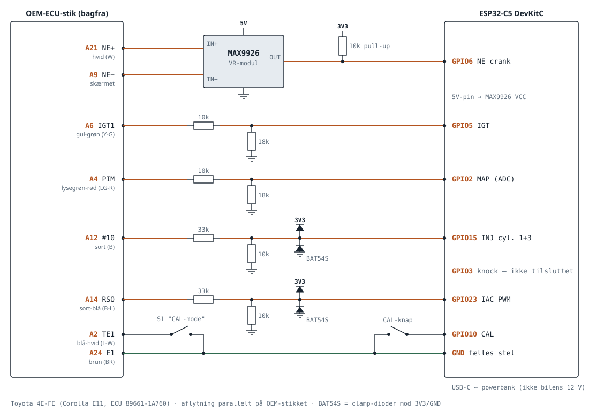
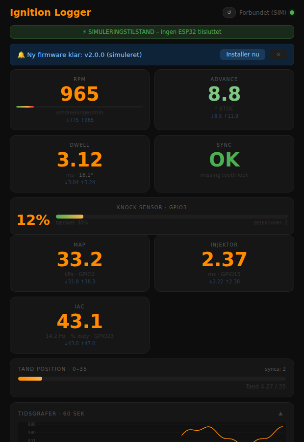
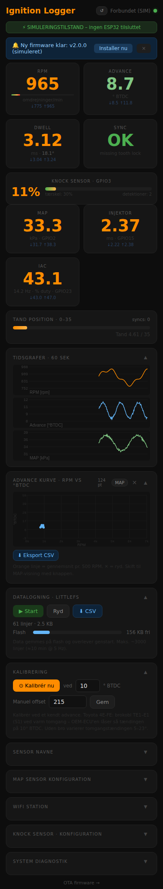

# OEM Ignition Logger

Reverse engineer Toyota 4E-FE OEM ECU via ESP32-C5.
Måler advance (°BTDC), dwell, RPM, MAP-tryk, injektor-pulsbredde og knock ud fra NE og IGT signaler.

---

## Sådan kommer du i gang

> Følg disse 5 trin. Tag ca. 30 minutter inkl. lodning.

### 1. Saml hardwaren

Loggeren sidder **parallelt bag på OEM-ECU'ens stik** (backprobe-nåle eller T-kabel), mens bilen kører på den originale ECU. Den lytter kun og må ikke belaste signalerne.



Du skal bruge:
- 1× **ESP32-C5-WROOM-1 DevKitC** (USB-C), forsynet fra en **powerbank** (ikke bilens 12 V – undgår stelsløjfer)
- 1× **MAX9926 VR-modul** (fx et Speeduino VR-board), forsynet fra DevKit'ets 5V-pin
- Modstande: **2× 10 kΩ + 2× 18 kΩ** (IGT, MAP), **2× 33 kΩ + 2× 10 kΩ** (INJ, IAC), **1× 10 kΩ** (pull-up på MAX9926 OUT)
- **2× BAT54S** (eller 2× 1N4148 pr. kanal) som clamp på INJ og IAC
- 1× momentan trykknap (CAL) og 1× vippekontakt (S1, TE1–E1)

```
NE (VR-sensor, ± AC):
  A21 NE+ ──► IN+ ┌─────────┐ OUT ──┬──────── GPIO6
  A9  NE− ──► IN− │ MAX9926 │       │
                  └─────────┘     [10k] → 3V3      (MAX9926 VCC = 5V, GND = E1)

IGT1 / PIM (5 V):                 INJ #10 / RSO (12 V + induktive spidser):
  ECU ──[10k]──┬── GPIO             ECU ──[33k]──┬────────┬── GPIO
             [18k]                             [10k]   BAT54S → 3V3 og GND
               │                                 │
              GND                               GND
```

> **NE er en VR-sensor.** Den giver ± vekselspænding, der stiger med omdrejningstallet, og skal gennem en VR-konditionering. En ren modstandsdeler sender negativ spænding ind i GPIO'en. NE− må **ikke** forbindes til stel (det er ECU'ens reference).
>
> **IGT er 5 V.** En 33k/10k-deler giver kun ca. 1,2 V, og ESP'en ser aldrig HIGH. Brug 10k/18k.

**Påkrævet:**
| Pin    | Signal       | ECU-pin (4E-FE) | Interface                         |
|--------|--------------|-----------------|-----------------------------------|
| GPIO6  | NE crank     | A21 NE+ / A9 NE− | MAX9926, OUT + 10k pull-up til 3V3 |
| GPIO5  | IGT ignition | A6 IGT1 (cyl. 1+4) | 10 k / 18 k (5 V)               |
| GPIO10 | CAL knap     | –               | Direkte til GND (intern pull-up)  |
| GND    | Fælles stel  | A24 E1          | Direkte                           |

**Valgfrit** (kan tilføjes senere – auto-detekteres):
| Pin    | Signal         | ECU-pin (4E-FE)       | Interface                    |
|--------|----------------|-----------------------|------------------------------|
| GPIO2  | MAP sensor     | A4 PIM                | 10 k / 18 k (5 V)            |
| GPIO15 | Fuel injektor  | A12 #10 (cyl. 1+3)    | 33 k / 10 k + BAT54S clamp   |
| GPIO23 | IAC ventil PWM | A14 RSO               | 33 k / 10 k + BAT54S clamp   |
| GPIO3  | Knock sensor   | **ikke tilsluttet**   | En deler belaster OEM-ECU'ens piezo-signal |
| GPIO21 | OLED SDA       | –                     | (ingen – I2C 3.3 V)          |
| GPIO20 | OLED SCL       | –                     | (ingen – I2C 3.3 V)          |

**Ledningsfarver og kontrolmåling (ECU-tilgangsledninger)**

Farver fra Haynes diagram 39, sammenholdt med autoelectric.ru. Identificér altid ledningen på **pin-position** og bekræft med **kontrolmålingen**. Farven er kun en ekstra kontrol: der er fx flere sorte ledninger i stikket (A10 OX, A12 #10, B1 TAC, B9 +B). Stikbilleder er tegnet fra ECU'ens side, så rækkefølgen er spejlvendt, når du arbejder bagfra på ledningsnettets stik.

| ECU-pin | Signal | Farve (Haynes) | autoelectric | Kontrolmåling før splejsning |
|---|---|---|---|---|
| A21 | NE+ | hvid (W) | sort (sw) | **Kilderne er uenige.** ECU frakoblet: 985–1600 Ω mellem A21 og A9 |
| A9 | NE− | skærmet | hvid (ws) | Se A21. Splejs uden at bryde skærmen |
| A6 | IGT1 | gul-grøn (Y-G) | ge-gn | Tomgang: lav DC-middelværdi, under ca. 1 V (korte pulser) |
| A4 | PIM | lysegrøn-rød (LG-R) | hgn-rt | Tænding til, motor stoppet: 3,3–3,9 V. Falder ved tomgang |
| A12 | #10 injektor 1+3 | sort (B) | sw | Tænding til, motor stoppet: ca. 12 V |
| A14 | RSO tomgangsventil | sort-blå (B-L) | sw-bl | Motor i gang: skiftende middelværdi mellem 0 og 12 V |
| A2 | TE1 | blå-hvid (L-W) | bl-ws | Tænding til: 9–14 V mod stel |
| A24 | E1 stel | brun (BR) | br | 0 V og under 1 Ω mod chassis |

Splejs uden at skære ledningen over (afisoleret "vindue" med lodning eller T-tap), så original-ECU'en kører uforstyrret. Byttes NE+ og NE− på MAX9926, trigger den på den modsatte flanke. Det fjernes af TE1-kalibreringen, men giver det ustabil sync, så byt de to.

**S1 (CAL-mode):** vippekontakt mellem **A2 TE1** og **A24 E1**. Når den er slået til, låser OEM-ECU'en tændingen på 10° BTDC (8–12°).

**Må ikke tilsluttes:** THW og THA (NTC'er med pull-up i ECU'en – en ekstra deler ændrer, hvad OEM-ECU'en læser), KNK1 (piezo, højimpedant).

> **Tip:** Forbind altid ESP32 **GND** til ECU'ens **E1** før noget andet.

### 2. Flash firmwaren

1. Tilslut ESP32-C5 via USB-C til din computer
2. Åbn **[⚡ Web Flasher](https://joachimth.github.io/esp32-ecu-reversing-for-speeduino/)** i Chrome eller Edge
3. Tryk **CONNECT** → vælg serial port → tryk **INSTALL**

Ingen drivere eller PlatformIO nødvendig.

### 3. Forbind til WiFi

ESP32 starter sit eget WiFi-netværk:

| | |
|--------------|-----------------|
| **SSID**     | `IgnLogger`     |
| **Password** | `ignition1`     |
| **URL**      | http://192.168.4.1 |

Telefon/PC åbner dashboardet automatisk via captive portal. Ellers tast adressen manuelt.

### 4. Kalibrér ved idle

1. Start motoren, og lad den køre, til køleventilatoren har slået til
2. **Slå S1 til** (TE1–E1 brokoblet). OEM-ECU'en låser nu tændingen på 10° BTDC. Uden broen varierer tomgangstændingen 5–23°, og kalibreringen bliver forkert
3. Vent 5 s, og **tryk kortvarigt på CAL-knappen** (eller tryk **Kalibrér** på dashboardet)
4. **Slå S1 fra** igen. Offset gemmes i flashen og bevares efter genstart

> Kalibreringsvinklen er 10° BTDC som standard. Det kan ændres via `/cal/set` eller dashboardet, hvis dit setup er anderledes.

**MAP:** Standard-skaleringen er preset'en **Toyota 4E-FE** (1,16 V = 20 kPa, 3,71 V = 105 kPa, ca. 0,03 V/kPa). Det er et startpunkt: med tænding til og motoren stoppet skal MAP vise dagens lufttryk (ca. 100 kPa), og ved varm tomgang 21–48 kPa.

### 5. Brug dashboardet

På dashboardet ser du i realtid:
- **RPM, Advance, Dwell, Sync** – altid synlige
- **MAP, Injektor, IAC, Knock** – vises automatisk når sensoren er forbundet
- **Live grafer** – RPM/ADV/MAP over 60 sek + Advance vs RPM scatter (din OEM tændingsmap)

For at gemme data til analyse:
1. Tryk **Start log** → kør motoren igennem dit ønskede driftspunkt
2. Tryk **Stop log** → tryk **Download CSV**
3. Åbn filen i Excel / Speeduino TunerStudio

**Firmware-opdatering (OTA):** Enheden checker automatisk for nye versioner hver 6. time når den er på WiFi.
Når en opdatering er klar vises et banner i dashboardet - tryk **Installer nu** og enheden opdaterer og genstarter selv (~30 sek).
Manuel upload er også muligt via http://192.168.4.1/update.
Auto-opdatering kan slås fra under Diagnostik i dashboardet.

---

## Pin-oversigt (komplet)

| Pin    | Signal         | Type     | ECU-pin (4E-FE)    | Interface                    | Status                   |
|--------|----------------|----------|--------------------|------------------------------|--------------------------|
| GPIO6  | NE crank       | Digital  | A21 / A9           | MAX9926 VR-modul + 10k pull-up | Påkrævet               |
| GPIO5  | IGT ignition   | Digital  | A6 IGT1            | 10 k / 18 k (5 V)            | Påkrævet                 |
| GPIO10 | CAL knap       | Digital  | –                  | Intern pull-up               | Påkrævet                 |
| GPIO2  | MAP sensor     | ADC1_CH2 | A4 PIM             | 10 k / 18 k (5 V)            | Valgfri, auto-detekteret |
| GPIO15 | Fuel injektor  | Digital  | A12 #10            | 33 k / 10 k + BAT54S         | Valgfri, auto-detekteret |
| GPIO23 | IAC ventil PWM | Digital  | A14 RSO            | 33 k / 10 k + BAT54S         | Valgfri, auto-detekteret |
| GPIO3  | Knock sensor   | ADC1_CH3 | ikke tilsluttet    | –                            | Samples, men ubrugt på 4E-FE |
| GPIO21 | OLED SDA       | I2C      | –                  | –                            | Reserveret (OLED p.t. deaktiveret) |
| GPIO20 | OLED SCL       | I2C      | –                  | –                            | Reserveret (OLED p.t. deaktiveret) |

**Reserverede pins der ikke må bruges:**
- GPIO12–14 → intern SPI flash i modulet
- GPIO18/19 → native USB D+/D-
- GPIO11 → UART0 TX (Serial monitor)

> OLED display er kodet men deaktiveret pga. en I2C HAL-bug i arduino-esp32 3.3.8 på ESP32-C5. Aktiveres automatisk når upstream-fixet kommer.

---

## Signaloversigt

- **NE**: VR-sensor på et 36-2 triggerhjul, konditioneret af MAX9926 til en digital puls. Første tand efter hullet = tand 0. Offset til TDC findes ved kalibrering.
- **IGT**: Tændingsordre (5 V). Rising = dwell start. Falling = gnist / ignition event. IGT1 tænder cyl. 1+4 (wasted spark), én gang pr. omdrejning.
- **MAP**: Analog tryk-sensor (Toyota PIM). Standard-preset: 1,16 V = 20 kPa, 3,71 V = 105 kPa.
- **INJ**: Fuel injektor puls (gruppe #10 = cyl. 1+3). Pulsbredde = indsprøjtningsvarighed.
- **IAC**: PWM signal fra ECU til den 1-spolede rotary solenoid (RSO/RSD). Duty cycle = ventil-åbning %.
- **Knock**: Analog resonanssignal. Peak-to-peak amplitude over 64 ADC-samples.

## Serial Monitor (115 200 baud)

CSV output på USB:
```
RPM,ADV,DWELL,TOOTH,SYNC
875,10.2,3.14,20.51,1
```

## Web UI simulator (uden ESP32)

Forhåndsvis dashboardet uden hardware - åbn direkte i browseren:

```bash
open sim/index.html
```

<p align="center">
  
  
</p>

Screenshots opdateres automatisk ved hvert CI-build. Se [`SCREENSHOTS.md`](SCREENSHOTS.md) for detaljer og manuel procedure.

## Byg lokalt (alternativt til Web Flasher)

```bash
cd firmware
pio run               # byg firmware
pio run -t buildfs    # byg LittleFS image
pio run -t upload     # flash firmware via USB
pio run -t uploadfs   # flash web dashboard via USB
pio device monitor    # serial monitor 115200 baud
```

**Platform**: pioarduino-fork af espressif32 kræves (officiel platform mangler ESP32-C5 support).
Se [`firmware/platformio.ini`](firmware/platformio.ini) for detaljer.

## Fejlsøgning

| Symptom | Mulig årsag | Løsning |
|---------|-------------|---------|
| RPM = 0, Sync = 0 | NE signal når ikke ESP32 | Tjek MAX9926 (5 V forsyning, IN+/IN− på A21/A9, pull-up på OUT) + GND fælles med ECU |
| RPM OK, Sync = 0 | Missing tooth ikke detekteret | Kør motoren over 500 RPM nogle sek. |
| Advance ser forkert ud | Offset ikke kalibreret | Slå S1 til (TE1–E1), tryk CAL ved varm tomgang, slå S1 fra |
| IGT/dwell = 0 | IGT når ikke HIGH-niveau | IGT er 5 V – brug 10k/18k, ikke 33k/10k |
| MAP-kort vises ikke | Sensor ikke aktiv | Sensor skal levere 0.24–3.06 V på GPIO2 |
| Kan ikke finde IgnLogger WiFi | ESP32 ikke booted | Tjek USB-strøm, kig efter "AP ready" på serial |
| Browser viser ikke captive portal | Manuel tilgang | Tast http://192.168.4.1 direkte |

## Første opsætning af repo (én gang for vedligeholdere)

### GitHub Pages
`Settings → Pages → Source: GitHub Actions → Save`

### Første release
```bash
git tag v1.0.0
git push origin v1.0.0
```
GitHub Actions bygger automatisk og uploader binaries. Web flasheren peger på `releases/latest`.

---

Se [`CLAUDE.md`](CLAUDE.md) for fuld teknisk dokumentation, API-reference, WebSocket-format, CSV-skema og roadmap.
