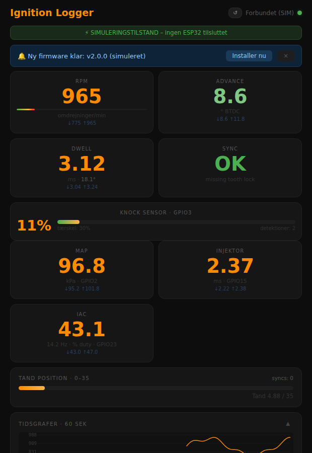
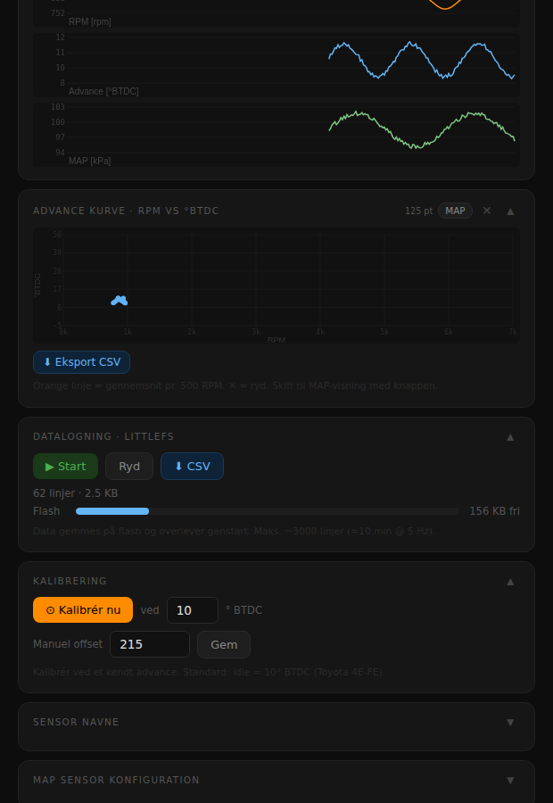
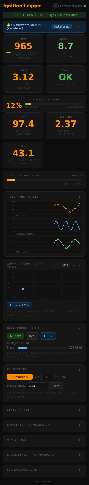

# Dashboard Screenshots

Screenshots genereres automatisk af CI ved hvert push via Playwright og den indbyggede simulator (`sim/index.html`).
Ingen ESP32 eller rigtig bil kræves - simulatoren producerer realistiske motordata (RPM ~875, advance ~10°, MAP ~98 kPa).

---

## Desktop

<p align="center">
  
</p>

<p align="center">
  
</p>

## Mobil (390px)

<p align="center">
  
</p>

---

## Tag screenshots manuelt

Kræver Node.js og Chromium (første gang):

```bash
cd sim
npm install
npx playwright install chromium
node screenshot.js
```

Outputfiler:
| Fil | Beskrivelse |
|-----|-------------|
| `sim/screenshot_top.png` | Desktop, øverste halvdel (RPM, advance, dwell, MAP, knock, IAC) |
| `sim/screenshot_bottom.png` | Desktop, nederste halvdel (grafer, scatter-plot) |
| `sim/screenshot_mobile.png` | Mobilvisning 390px bred, fuld side |

Screenshots committes automatisk af CI - du behøver normalt ikke køre dette selv.

---

## Simulator

`sim/index.html` er identisk med det rigtige dashboard, men WebSocket er erstattet af en
JavaScript-generator der kører 120 datasimuleringer ved sideindlæsning.

```bash
# Åbn direkte i browser (ingen server nødvendig)
open sim/index.html
```
